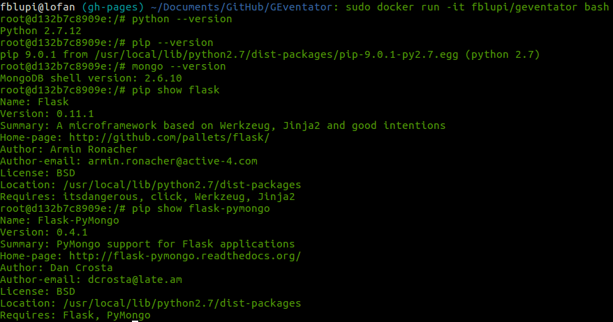

# GEventator

## Docker

Instalar Docker en la máquina local:

```
sudo apt-get update
sudo apt-get install apt-transport-https ca-certificates
sudo apt-key adv --keyserver hkp://ha.pool.sks-keyservers.net:80 --recv-keys 58118E89F3A912897C070ADBF76221572C52609D
echo "deb https://apt.dockerproject.org/repo ubuntu-xenial main" | sudo tee /etc/apt/sources.list.d/docker.list
sudo apt-get update
apt-cache policy docker-engine
sudo apt-get update
sudo apt-get install linux-image-extra-$(uname -r) linux-image-extra-virtual
sudo apt-get update
sudo apt-get install docker-engine
sudo service docker start
```

Ejecutar las órdenes para instalarlo desde el repositorio en Docker Hub:

```
sudo service docker restart
sudo docker pull fblupi/geventator
```

Para conectarse a una consola usar:

```
sudo docker run -it fblupi/geventator bash
```

El resultado de salida tiene que ser similar al siguiente:


