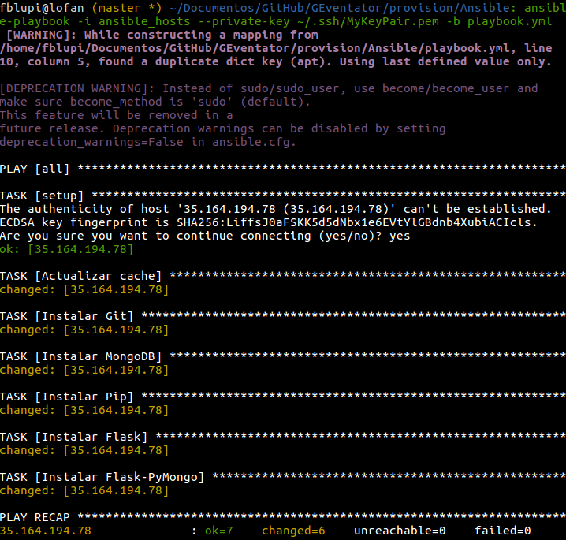
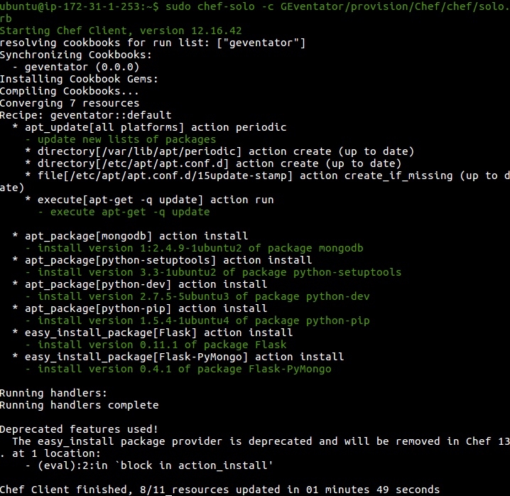

# GEventator

## Provisionamiento

### Ansible

Instalar Ansible en la máquina local:

```
sudo apt-get install ansible
```

En primer lugar cambiar el fichero `ansible_hosts` con la ip correspondiente a una máquina virtual AWS que contenga una imagen de Ubuntu 14.04.

Copiar la clave privada (archivo `.pem`) para conectarse a esa máquina virtual en este directorio y ponerle como nombre `key.pem`.

Ejecutar la orden:

```
ansible-playbook -i ansible_hosts --private-key key.pem -b playbook.yml
```



### Chef

Al igual que con Ansible, se utiliza una imagen de Ubuntu Server 14.04 en AWS.

Para provisionar con chef. Lo primero que hay que hacer es instalarlo en la máquina virtual. Para ello hay que conectarse mediante ssh y ejecutar:

```
curl -L https://www.opscode.com/chef/install.sh | sudo bash
```

A continuación instalar Git para clonar el repositorio con los archivos necesarios:

```
sudo apt-get install git
```

Y clonarlo:

```
git clone https://github.com/fblupi/GEventator.git
```

Provisionar con chef-solo:

```
sudo chef-solo -c GEventator/provision/Chef/chef/solo.rb
```



---

Volver a [home](index)
